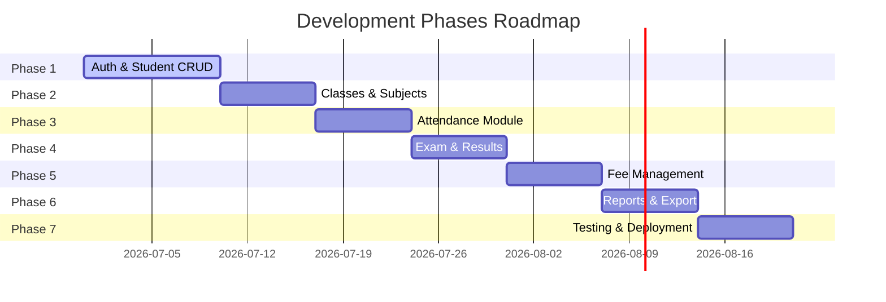

# Student Management System - Project Implementation Plan

This implementation plan details the architecture, file structure, database schema, and development roadmap for the web-based **Student Management System** as specified in [Planing_Document.txt](file:///e:/Projects/Full%20Stack%20Zone%20(Internship)/Student_Managment_System/Planing_Document.txt).

The system is designed for institutions to manage students, teachers, classes, subjects, attendance, exams, fees, and reports. It features three primary user roles: **Admin**, **Teacher**, and **Student**.

---

## User Review Required

> [!IMPORTANT]
> **Tech Stack Confirmation**
> The recommended tech stack in the planning document is the **MERN Stack** (MongoDB, Express, React, Node.js) with **Tailwind CSS**.
> Since system instructions suggest Vanilla CSS by default unless Tailwind is explicitly requested, we need your confirmation.
> - **We propose proceeding with Tailwind CSS (v3 or v4)** as specified in your Planning Document. Please confirm your preferred version of Tailwind CSS.

> [!NOTE]
> **Deployment Details**
> The planned hostings are Vercel (Frontend) and Render (Backend). We will structure the project as a monorepo containing `frontend` and `backend` directories to simplify development and deployment.

---

## Open Questions

> [!IMPORTANT]
> 1. **MongoDB Connection:** Do you have an active MongoDB Atlas cluster URI that we should configure in our `.env` file, or should we set up a local MongoDB URI (`mongodb://localhost:27017/student_db`) for local development first?
> 2. **Cloudinary Credentials:** Since profile photo uploads require Cloudinary, should we mock the photo upload locally first (saving to local `uploads/` directory) and switch to Cloudinary once API keys are provided?
> 3. **Attendance Type:** Should attendance be tracked primarily *per day* (general school model) or *per subject* (university/college model), or should we support both configurations dynamically?
> 4. **Student ID Generation Format:** Do you have a specific pattern for the auto-generated Student ID (e.g., `SMS-YYYY-XXXX` where YYYY is the admission year and XXXX is a sequential number)?

---

## Architecture & Database Design

### Database Schema Design (MongoDB & Mongoose)

```mermaid
erDiagram
    User ||--o| Student : "has profile"
    User ||--o| Teacher : "has profile"
    Class ||--o{ Student : "contains"
    Class ||--o{ Subject : "has"
    Teacher ||--o{ Subject : "teaches"
    Student ||--o{ Attendance : "records"
    Subject ||--o{ Attendance : "marked for"
    Subject ||--o{ Exam : "assessed by"
    Student ||--o{ Result : "obtains"
    Exam ||--o{ Result : "contains"
    Class ||--o{ FeeStructure : "defines fees for"
    Student ||--o{ FeePayment : "pays"
    FeeStructure ||--o{ FeePayment : "references"

    User {
        ObjectId id PK
        string name
        string email UK
        string password
        string role "admin | teacher | student"
        date createdAt
    }

    Student {
        ObjectId id PK
        ObjectId user_id FK
        string roll_no UK
        ObjectId class_id FK
        string program
        string cnic
        date dob
        string photo_url
        string contact
    }

    Teacher {
        ObjectId id PK
        ObjectId user_id FK
        string qualification
        string department
        string contact
    }

    Class {
        ObjectId id PK
        string name "e.g., Class 10"
        string section "e.g., A"
        string program "e.g., Metric, FSc, BSCS"
    }

    Subject {
        ObjectId id PK
        string name
        string code UK
        number credit_hours
        ObjectId class_id FK
        ObjectId teacher_id FK
    }

    Attendance {
        ObjectId id PK
        ObjectId student_id FK
        ObjectId subject_id FK "optional"
        date date
        string status "Present | Absent | Late | Leave"
    }

    Exam {
        ObjectId id PK
        string name "Midterm | Final | Quiz | Assignment"
        string type
        ObjectId subject_id FK
        number total_marks
        date date
    }

    Result {
        ObjectId id PK
        ObjectId student_id FK
        ObjectId exam_id FK
        number obtained_marks
        string grade "A | B | C | F"
        number gpa
    }

    FeeStructure {
        ObjectId id PK
        string name "Tuition | Lab | Library"
        number amount
        ObjectId class_id FK
    }

    FeePayment {
        ObjectId id PK
        ObjectId student_id FK
        ObjectId fee_structure_id FK
        number amount_paid
        number fine_amount
        date paid_on
        string status "Paid | Pending | Overdue"
        string challan_no UK
    }
```

---

## Proposed Changes

We will initialize a clean MERN monorepo structured as follows:
```
Student_Managment_System/
├── backend/                  # Node.js + Express + Mongoose Backend
│   ├── src/
│   │   ├── config/          # Database, Cloudinary config
│   │   ├── controllers/     # Route logic handlers
│   │   ├── middleware/      # Auth & Role validation
│   │   ├── models/          # Mongoose Schemas
│   │   ├── routes/          # Express API Endpoints
│   │   └── index.js         # Entry Point
│   ├── .env.example
│   └── package.json
└── frontend/                 # React + Vite + Tailwind CSS Frontend
    ├── src/
    │   ├── assets/
    │   ├── components/      # Shared components (Tables, Sidebar, Header, Alerts)
    │   ├── context/         # AuthContext
    │   ├── pages/           # Admin Dashboard, Teacher Attendance, Student Results, etc.
    │   ├── App.jsx
    │   └── main.jsx
    ├── tailwind.config.js
    └── package.json
```

### [NEW] Backend Component

#### [NEW] [index.js](file:///e:/Projects/Full%20Stack%20Zone%20(Internship)/Student_Managment_System/backend/src/index.js)
The entry point of the server, initializing Express app, database connection, middlewares (cors, helmet, morgan), and standard error handlers.

#### [NEW] [db.js](file:///e:/Projects/Full%20Stack%20Zone%20(Internship)/Student_Managment_System/backend/src/config/db.js)
MongoDB Mongoose connection establishment module.

#### [NEW] [auth.js](file:///e:/Projects/Full%20Stack%20Zone%20(Internship)/Student_Managment_System/backend/src/middleware/auth.js)
JWT authorization and role-based permissions verifier (e.g. `protect`, `authorize('admin', 'teacher')`).

#### [NEW] schemas
Mongoose schema declarations for `User`, `Student`, `Teacher`, `Class`, `Subject`, `Attendance`, `Exam`, `Result`, `FeeStructure`, and `FeePayment` mapping directly to the database design.

#### [NEW] routes
API controllers and route handlers organized by concern: `/api/auth`, `/api/students`, `/api/teachers`, `/api/classes`, `/api/subjects`, `/api/attendance`, `/api/exams`, and `/api/fees`.

---

### [NEW] Frontend Component

#### [NEW] [main.jsx](file:///e:/Projects/Full%20Stack%20Zone%20(Internship)/Student_Managment_System/frontend/src/main.jsx)
Frontend application bootstrap setting up React Router, tailwind stylesheet import, and context providers.

#### [NEW] Context Providers
`AuthContext` for managing stateful session storage, JWT persistence in localStorage, and authentication routing safeguards.

#### [NEW] Views and Pages
- **Auth**: Login page and password reset request.
- **Admin Portal**: Users overview (CRUD students/teachers), subject mapping, class allocations, reports, fee setup.
- **Teacher Portal**: Class management, mark attendance per subject/class, grade book submissions.
- **Student Portal**: View dashboard (fee details, attendance logs, exam transcript, profile card).

---

## Development Phases

We will execute the implementation in 7 logical phases to guarantee robust testing and incremental validation.



### Phase 1: Authentication & Student CRUD (Days 1–10)
- Set up express/mongoose monorepo workspace.
- Implement signup/login authentication API using JWT and bcrypt.
- Develop student enrollment logic, unique Roll Number generation, and local/Cloudinary picture upload.
- Create responsive frontend authentication views and basic Admin user list.

### Phase 2: Academic Setup (Classes, Subjects & Teachers) (Days 11–17)
- Establish Class creation schemas (grade, section, program).
- Enable Subject mapping (credit hours, codes) and assign subjects to classes.
- Admin dashboard view for associating teachers to classes and subjects.

### Phase 3: Attendance Operations (Days 18–24)
- Create models for recording attendance records.
- Teacher interface to register daily/subject-wise attendance.
- Student analytics dashboard displaying cumulative presence percentage and threshold alerts (under 75%).

### Phase 4: Exam & Result Modules (Days 25–31)
- Standardized exam structures (Quiz, Assignment, Midterm, Finals).
- Grades entry forms with automated GPA and percentage computation.
- Printable/exportable student transcripts generator.

### Phase 5: Fee Auditing & Receipts (Days 32–38)
- Dynamic Fee structures allocation based on Program or Class.
- Automatic fee challan generator and monthly payment logging.
- Outstanding balance/late payment tracking with automatic fine accruals.

### Phase 6: Interactive Dashboard & Reporting (Days 39–45)
- Admin reporting overview: total revenue, attendance averages, class-wise distributions.
- Reports generation with PDF export support (using `pdfkit` / `react-pdf`) and Excel sheet exports (using `xlsx`).

### Phase 7: Verification & Final Deployment (Days 46–52)
- Monorepo production configuration adjustments.
- Deploying client codebase to Vercel and API service to Render.

---

## Verification Plan

### Automated Tests
We will set up Jest/Supertest for backend integration tests and Vitest/React Testing Library for frontend components.
- Run backend tests:
  ```bash
  npm run test:backend
  ```
- Run frontend tests:
  ```bash
  npm run test:frontend
  ```

### Manual Verification
1. **Roles validation**: Verify that teacher views are inaccessible to students, and admin settings are isolated.
2. **Attendance Alert Checks**: Mock data where student attendance drops below 75% to check threshold alert UI elements.
3. **Receipt Generation**: Generate a dummy fee challan and verify formatting of the exported PDF/Excel file.
